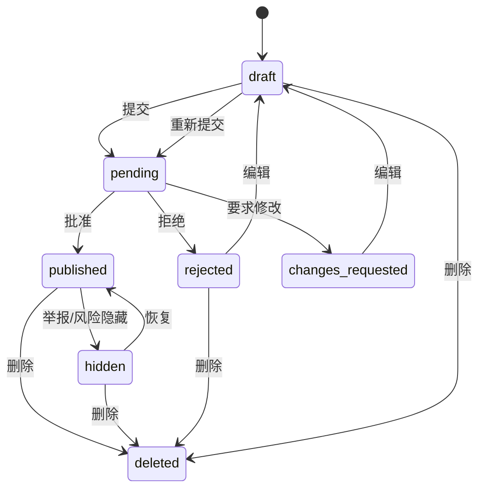
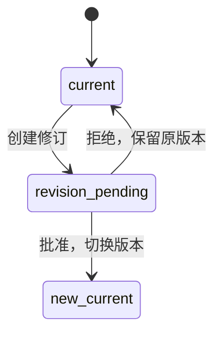
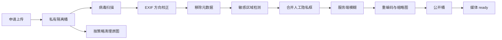
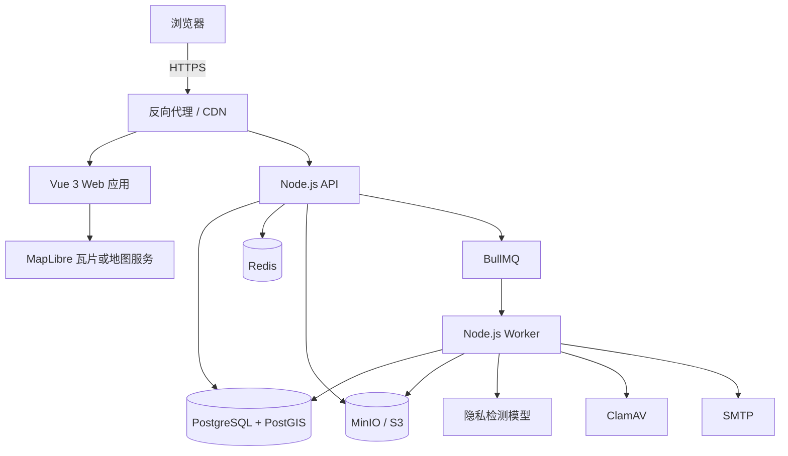

# 公共空间细节地图 项目文档

> 文档版本：v1.0  
> 文档状态：实现基线  
> 目标形态：可部署、可运营、可审核、可追溯的真实 Web 产品  
> 核心约束：Vue 3 负责地图浏览与标注交互；Node.js 负责业务 API、内容审核、评论、媒体隐私模糊化。  
> 本文只定义项目，不创建业务代码；后续实现必须遵守本文，不得以 demo、内存数据或前端假数据替代真实闭环。

---

## 1. 项目定义

### 1.1 一句话定义

“公共空间细节地图”是一个面向公众的 Web 地图工具。用户可以在真实地图位置上记录长椅、饮水处、遮雨棚、安静角落、夜间照明等公共空间细节，上传经过隐私处理的照片，提交评论和纠错；管理员审核后，内容才对所有访客公开。

### 1.2 解决的问题

传统地图通常只显示名称、地址和路线，无法回答以下实际体验问题：

- 这里有没有长椅，长椅是否有靠背、遮阳和轮椅空间？
- 饮水处是否可用，出水是否适合直接饮用？
- 下雨时附近是否有遮雨棚，能容纳多少人？
- 哪里适合安静休息，什么时候人少、噪音低？
- 夜间是否有照明，亮度、覆盖范围和安全感如何？
- 原有信息是否仍然准确，是否已经损坏、关闭或改变用途？

产品目标是把“地点存在”升级为“地点实际体验可验证”，并通过审核、评论、时效确认和隐私保护降低错误信息与滥用风险。

### 1.3 成功标准

项目满足以下条件才视为成功：

1. 访客无需登录即可浏览已发布的公共空间细节。
2. 注册用户可以创建、编辑、提交、撤回和删除自己的内容。
3. 所有新内容在审核通过前不可被公众看到。
4. 审核员可以在后台批准、拒绝、隐藏内容，并留下理由和审计记录。
5. 评论支持发布、编辑、删除、举报和审核。
6. 照片上传后由 Node.js 服务端完成病毒扫描、元数据清理、隐私区域模糊、重编码和公开发布。
7. 未模糊的原始图片不能通过公开 URL 被访问。
8. 地图支持按区域、分类、可用性、无障碍和更新时间筛选。
9. 系统具备完整的错误处理、权限控制、限流、日志、备份和恢复方案。
10. 全新环境可以连接真实 PostgreSQL/PostGIS、Redis、MinIO 和邮件服务，不依赖 mock。

### 1.4 产品原则

- **真实优先**：没有数据库、对象存储、审核队列和权限系统的实现不属于本项目。
- **默认不公开**：用户内容、评论和媒体默认处于待审核状态。
- **隐私优先**：原始媒体不公开，服务端是唯一的隐私模糊与发布执行者。
- **可纠正**：错误内容可以被举报、评论、再次确认、修改或隐藏。
- **可追溯**：审核、举报处理和管理员操作必须写入审计日志。
- **地图无障碍**：除地图外提供列表视图，键盘用户可以使用核心流程。
- **范围明确**：V1 只做公众可到达的公共空间，不记录私人住宅内部、受限区域或实时人员位置。

### 1.5 V1 范围

V1 必须实现：

- 地图浏览、分类筛选、空间范围查询、聚合显示和详情查看。
- 长椅、饮水处、遮雨棚、安静角落、夜间照明五类细节。
- 用户注册、邮箱验证、登录、刷新会话、退出、密码找回。
- 用户投稿、草稿、提交审核、编辑、拒绝后重提、软删除。
- 管理员审核队列、批准、拒绝、隐藏、恢复、举报处理。
- 评论发布、编辑、删除、举报、审核。
- 图片上传、隐私标记、服务端模糊、缩略图、公开发布和原图隔离。
- 内容时效确认：用户可标记“仍然准确”“已变化”“已关闭”。
- 管理后台基础页面、审计日志、操作原因码。
- 移动端适配、基础无障碍、中文界面。
- 本地与生产部署、数据库迁移、备份和恢复脚本。

V1 不实现：

- 原生 iOS/Android 应用。
- 视频、音频、直播和实时轨迹。
- 用户之间私信、社交关注和公开聊天室。
- 导航、路线规划和交通调度。
- 自动根据用户位置持续上传或后台采集位置。
- 外部广告、付费推广和商业排名。
- 未经人工审核即公开的 AI 自动内容发布。

---

## 2. 用户角色与权限

| 角色 | 获取方式 | 核心权限 |
|---|---|---|
| 访客 Visitor | 无需登录 | 浏览已发布地图内容、查看已发布评论、使用筛选和列表视图 |
| 贡献者 Contributor | 注册并验证邮箱 | 投稿、编辑自己的内容、评论、举报、确认时效、管理自己的账号 |
| 审核员 Moderator | 由管理员授予 | 审核内容、审核评论、处理举报、隐藏违规内容、查看必要审计信息 |
| 管理员 Admin | 受控初始化或管理员授予 | 管理用户角色、分类、系统配置、审核策略、审计日志和封禁 |

权限规则：

- 访客只能读取 `published` 内容。
- 贡献者只能修改自己的草稿、待审核版本和已发布版本的新修订；不能直接修改已发布内容。
- 审核员不能修改用户原始文本，只能批准、拒绝、隐藏或要求修改。
- 管理员不能物理删除审计日志；只能发起保留期到期后的归档。
- 所有管理端点必须同时校验角色、资源归属和账号状态。
- 管理员和审核员账号在生产环境应启用 TOTP 二次验证。

---

## 3. 核心用户闭环

### 3.1 浏览与查找闭环

1. 访客打开地图。
2. 浏览器只在用户主动点击定位按钮后请求定位权限。
3. 地图按当前视口请求可见区域内的已发布内容。
4. 用户按分类、可用性、无障碍条件、更新时间和关键词筛选。
5. 低缩放级别下显示聚合点，高缩放级别下显示分类标记。
6. 点击标记后展示详情、照片、属性、最近确认时间、评论和举报入口。
7. 访客可以切换到列表视图，获得与地图等价的筛选结果。

### 3.2 投稿闭环

1. 贡献者登录并进入投稿页。
2. 选择分类，在地图上选点，填写结构化属性和说明。
3. 上传照片并为隐私敏感区域添加矩形标记。
4. 服务端处理全部媒体；处理完成前不允许提交公开。
5. 用户提交审核，内容状态变为 `pending`。
6. 审核通过后进入公开地图；审核拒绝时显示理由码和修改建议。
7. 用户修改后重新提交，不丢失历史审核记录。

### 3.3 编辑闭环

1. 已公开内容的作者创建新修订。
2. 新修订进入 `pending`，原公开版本继续对外可见。
3. 审核通过后原子切换为新的公开版本。
4. 审核拒绝后原公开版本不受影响，作者可以继续修改或放弃修订。
5. 每次批准保存版本号和变更审计。

### 3.4 评论闭环

1. 登录用户对已发布内容发表评论。
2. 评论默认进入 `pending`。
3. 审核通过后公开；拒绝后仅作者和管理员可见。
4. 作者可在发布时间 15 分钟内编辑一次，编辑后重新进入审核。
5. 用户可删除自己的评论；删除后公开侧立即不可见。
6. 其他用户可以举报评论，举报进入管理员队列。

### 3.5 举报与纠错闭环

1. 用户举报内容或评论，必须选择原因。
2. 达到风险阈值或审核员手动处理后，目标可被临时隐藏。
3. 审核员查看原内容、举报记录、历史审核和必要媒体证据。
4. 审核员选择驳回举报、要求修改、隐藏、删除或封禁作者。
5. 处理结果写入审计日志，并通知举报人。
6. 被误处理的内容可以由管理员恢复，恢复操作同样留痕。

### 3.6 账号与数据闭环

1. 用户可修改昵称、密码和通知设置。
2. 用户可导出自己的账号数据。
3. 用户可申请删除账号。
4. 进入 30 天冷静期后，账号身份信息匿名化，公开贡献可选择删除或保留为匿名内容。
5. 媒体对象按保留策略删除，审计记录按法规和运营策略保留最小必要信息。

---

## 4. 功能需求

### 4.1 地图浏览

地图使用 MapLibre GL JS，底图地址通过 `VITE_MAP_STYLE_URL` 配置。

必须支持：

- 平移、缩放、旋转和回到初始位置。
- 当前视口范围查询，只加载所需标记。
- 标记聚合、分类图标、选中态和键盘聚焦态。
- 分类筛选、多选筛选和一键清除。
- 关键词搜索标题、说明和标签。
- 更新时间、可用状态、无障碍条件筛选。
- 当前地图中心附近的列表视图。
- 地图版权声明始终可见。
- 定位按钮仅在用户主动操作后启用。
- 不记录用户精确位置，不把定位结果写入数据库。

底图策略：

- 开发环境可使用合规的公共瓦片服务，但必须遵守服务条款和限流要求。
- 生产环境必须使用自托管瓦片、商业授权瓦片或明确允许生产使用的服务。
- 地图供应商不得写入前端硬编码密钥；需要密钥的服务由 Node.js 反向代理或短期令牌服务提供。

### 4.2 内容分类与属性

所有分类共享以下字段：

| 字段 | 类型 | 必填 | 说明 |
|---|---|---:|---|
| `categoryKey` | 枚举 | 是 | 五类分类之一 |
| `title` | 字符串 | 是 | 3 至 80 个字符 |
| `description` | 字符串 | 是 | 10 至 2000 个字符 |
| `geometry` | Point | 是 | WGS84 经纬度 |
| `locationAccuracyM` | 整数 | 是 | 建议值 3 至 100 米 |
| `observedAt` | 时间 | 是 | 用户实际观察时间 |
| `condition` | 枚举 | 是 | `good`、`fair`、`poor`、`unknown` |
| `stepFree` | 布尔/未知 | 否 | 是否无台阶到达 |
| `wheelchairAccessible` | 布尔/未知 | 否 | 是否适合轮椅使用 |
| `noiseLevel` | 1 至 5 | 否 | 1 极安静，5 很吵 |
| `tags` | 字符串数组 | 否 | 最多 8 个，每个最多 24 字符 |
| `mediaIds` | UUID 数组 | 否 | 最多 6 张已处理图片 |

分类专属字段：

| 分类 | 关键属性 |
|---|---|
| 长椅 `bench` | 座位数、靠背、遮阳、遮蔽、扶手、轮椅空间、材质、破损情况 |
| 饮水处 `drinking_water` | 是否可饮用、出水类型、是否可接瓶、工作状态、季节性、水压、无障碍 |
| 遮雨棚 `rain_shelter` | 顶棚、容量、挡风、座位、开放时间、积水、结构状况 |
| 安静角落 `quiet_corner` | 噪音等级、座位、电源、Wi-Fi、拥挤程度、适合活动、推荐时段 |
| 夜间照明 `night_lighting` | 亮度、覆盖范围、色温、灯具类型、开关时间、损坏灯数、安全感评分 |

实现约束：

- 分类由数据库种子提供，不允许前端写死业务规则。
- 每个分类拥有版本化的 `detailSchema`，由前后端共享 Zod 合约校验。
- 分类结构变更必须通过迁移和版本号处理，旧内容仍可读取。
- 未知值必须显式表示为 `unknown`，不能以空字符串冒充。

### 4.3 投稿与编辑

投稿页必须提供：

- 地图选点、坐标输入和准确性说明。
- 分类选择。
- 分类专属表单。
- 标题、说明、观察时间和标签。
- 图片上传及隐私区域标记。
- 表单自动保存为草稿。
- 提交前校验。
- 提交确认和法律声明。
- 审核状态时间线。
- 拒绝原因展示与重新提交入口。
- 已发布内容创建新修订的入口。

草稿与版本规则：

- 草稿只对作者和管理员可见。
- 已发布内容不允许原地覆盖。
- 每次提交创建不可变修订快照。
- 批准时以事务方式切换当前公开修订。
- 删除采用软删除，公开查询立即过滤，管理员保留审计记录。
- 同一用户短期内不得重复提交高度相似的坐标和分类内容。

### 4.4 评论

评论要求：

- 只有登录且验证邮箱的用户可以评论。
- 评论以纯文本保存，禁止 HTML 注入。
- 长度 1 至 1000 字符。
- 支持两级回复，不允许无限嵌套。
- 默认进入 `pending`，审核后公开。
- 作者可在 15 分钟内编辑一次，编辑后重新审核。
- 作者可随时删除，删除对公开侧立即生效。
- 用户可以举报评论，同一用户对同一评论只能有一个有效举报。
- 评论限流默认每分钟 5 条、每天 50 条，可由管理员调整。
- 评论不展示邮箱、IP、精确位置等个人信息。

### 4.5 时效确认

为了让信息持续可靠，增加轻量级时效确认：

- 登录用户可对已发布内容选择 `still_accurate`、`changed`、`closed`。
- 同一用户对同一内容 90 天内只能确认一次。
- 确认不会直接覆盖内容。
- 当“已变化”或“已关闭”达到阈值时，内容进入重新审核队列。
- 详情页显示最近确认时间和确认分布，不公开逐条用户轨迹。
- 管理员可重置确认状态或延长有效期。

默认阈值：

- 内容发布 180 天后进入“建议复核”状态。
- 7 天内出现 3 个独立用户标记“已关闭”，自动进入高优先级审核。
- 审核员可批准更新、标记过期或隐藏。

### 4.6 审核后台

审核员必须能够：

- 查看待审核内容、修订、评论和媒体。
- 按分类、风险、时间、举报数和作者筛选。
- 查看结构化内容、坐标、媒体隐私处理报告和历史审核记录。
- 批准、拒绝、要求修改、隐藏、恢复和标记重复。
- 使用标准原因码并填写必要的审核备注。
- 对内容执行临时隐藏，防止高风险内容继续公开。
- 查看举报处理时间线和系统自动检查结果。

自动检查只做辅助，不得替代 V1 的人工发布决策：

- 文本长度、URL 数量、重复文本和敏感词提示。
- 坐标是否落在允许范围、是否为重复坐标。
- 图片哈希和感知哈希重复检测。
- 媒体隐私处理成功与否。
- 投稿频率和账号风险标记。

### 4.7 通知

系统通过站内通知和邮件通知以下事件：

- 邮箱验证。
- 密码重置。
- 投稿批准、拒绝、要求修改。
- 评论批准、拒绝或被删除。
- 举报处理结果。
- 账号角色变化。
- 账号删除请求和完成状态。

通知发送采用事务性 outbox，数据库事务成功后由工作进程投递，避免“业务成功但邮件丢失”。

---

## 5. 内容状态机

### 5.1 内容状态

| 状态 | 含义 | 公开可见 |
|---|---|---:|
| `draft` | 作者私有草稿 | 否 |
| `pending` | 等待审核 | 否 |
| `published` | 已批准发布 | 是 |
| `rejected` | 审核拒绝 | 否 |
| `changes_requested` | 要求作者修改 | 否 |
| `hidden` | 因举报、风险或运营原因隐藏 | 否 |
| `deleted` | 作者或管理员软删除 | 否 |

状态流转：



已发布修订的更新流程：



### 5.2 评论状态

| 状态 | 含义 | 公开可见 |
|---|---|---:|
| `pending` | 等待审核 | 否 |
| `published` | 已批准 | 是 |
| `rejected` | 审核拒绝 | 否 |
| `hidden` | 因举报或风险隐藏 | 否 |
| `deleted` | 作者或管理员删除 | 否 |

### 5.3 媒体状态

| 状态 | 含义 | 可否引用 |
|---|---|---:|
| `quarantined` | 已上传到私有隔离区 | 否 |
| `scanning` | 病毒扫描中 | 否 |
| `processing` | 元数据清理和隐私模糊中 | 否 |
| `manual_review` | 自动检测存在不确定项，需要人工确认 | 否 |
| `publishing` | 已认领发布，正在复制公开对象（原子中间态） | 否 |
| `ready` | 已完成处理并可被审核引用 | 是 |
| `rejected` | 安全或隐私检查失败 | 否 |
| `failed` | 处理失败，可重试或删除 | 否 |
| `deleted` | 已删除 | 否 |

---

## 6. 隐私模糊与媒体处理

### 6.1 总体原则

- Node.js 工作进程是唯一可信的媒体处理者。
- 前端可以预览模糊效果，但客户端结果不被信任。
- 原始文件存放在私有隔离桶，不具备公开读取权限。
- 公开发布的文件必须由服务端从原始文件重新生成。
- 任何未完成隐私处理的图片不得附加到待审核内容。
- 审核员只能通过短期签名 URL 查看必要证据，查看行为写入审计日志。

### 6.2 上传流程

1. 客户端向 API 申请上传。
2. API 校验用户、配额、文件类型和预计大小。
3. 客户端使用短期签名 URL 上传到私有隔离桶。
4. 客户端提交隐私矩形、拍摄声明和版权声明。
5. 工作进程执行病毒扫描。
6. 工作进程按 EXIF 方向校正图片，再移除全部 EXIF、GPS、设备序列号等元数据。
7. 自动检测人脸和其他已启用敏感区域。
8. 将自动检测结果与用户手动画框合并。
9. 使用服务端参数执行高斯模糊或强像素化。
10. 重新编码为 WebP/JPEG，并生成缩略图。
11. 计算 SHA-256 和感知哈希。
12. 写入公开对象桶，媒体状态变为 `ready`。
13. 原始隔离文件按策略自动删除。

处理管线：



### 6.3 隐私区域规则

- 隐私矩形使用 EXIF 校正后的归一化坐标 `x`、`y`、`width`、`height`。
- 服务端负责从归一化坐标换算到实际像素，避免前端旋转差异。
- 模糊范围必须向矩形外扩展安全边距，避免边缘未覆盖。
- 自动检测置信度阈值、扩展比例和模糊强度由服务端配置决定。
- 若自动检测发现未覆盖区域，服务端应自动扩大模糊区域，而不是直接发布。
- 若检测服务不可用，图片进入 `manual_review`，不得变为 `ready`。
- 审核员确认隐私处理后，系统仍保存处理报告和处理时间。

### 6.4 文本隐私

- 标题、说明和评论不得公开手机号、邮箱、身份证号、住址等个人信息。
- 系统可提示疑似个人信息，但最终由审核员处理。
- 举报和审核备注不对普通用户公开。
- 日志中不得记录密码、令牌、原图 URL 或完整个人信息。

### 6.5 媒体限制

- 格式：JPEG、PNG、WebP。
- 单张大小：默认不超过 10 MB。
- 像素上限：默认不超过 2000 万像素。
- 每条内容：默认最多 6 张。
- V1 不支持 GIF、SVG、视频、音频和外部图片 URL。
- 上传接口必须校验 MIME、文件头、尺寸和解码结果，不能只信任扩展名。
- 生产环境应接入 ClamAV 或等价恶意文件扫描服务。

### 6.6 原图保留策略

- 成功生成公开文件后，原始隔离文件默认在 24 小时内删除。
- 处理失败的原始文件最多保留 7 天，供安全排查或重试；到期强制删除。
- 被拒绝的敏感图片默认保留 7 天，之后删除或进入受限证据归档。
- 所有保留时间均通过配置控制，不得写死在业务逻辑中。
- 删除对象后保留不可逆哈希和审计事件，不保留原始内容。

---

## 7. 技术架构

### 7.1 技术栈

前端：

- Vue 3 + TypeScript + Vite。
- Vue Router。
- Pinia：认证、用户偏好、UI 局部状态。
- TanStack Query Vue：服务端状态、缓存、失效和重试。
- MapLibre GL JS：地图、标记、聚合、图层和交互。
- VeeValidate + Zod：表单和共享校验。
- Tailwind CSS + Radix Vue：可访问 UI 组件。
- Vitest + Vue Test Utils：单元和组件测试。
- Playwright：端到端测试。

后端：

- Node.js LTS + TypeScript。
- Fastify：HTTP API。
- Zod：请求、响应和共享合约校验。
- Kysely + `pg`：类型安全 SQL 和 PostgreSQL/PostGIS。
- PostgreSQL + PostGIS：业务数据和空间查询。
- Redis + BullMQ：媒体处理、邮件投递和通知队列。
- MinIO 或 S3 兼容对象存储：私有原图、公开处理图和缩略图。
- Sharp：服务端图像解码、旋转、裁剪、模糊和重编码。
- ONNX Runtime Node 或等价推理运行时：敏感区域检测插件。
- Pino：结构化日志。
- OpenTelemetry：指标、链路和告警接入。
- Argon2id：密码哈希。
- SMTP：邮件；开发环境使用 Mailpit。
- ClamAV：恶意文件扫描。

共享包：

- `contracts`：Zod 请求/响应、分类详情 schema、错误码。
- `config`：环境变量解析和配置校验。
- `db`：迁移、查询类型和种子。
- `test-utils`：真实测试容器和测试数据工厂。

### 7.2 运行架构



职责边界：

- Web 应用只负责展示、编辑和收集隐私区域，不发布媒体。
- API 负责认证、权限、业务校验、审核、评论、举报和 URL 签发。
- Worker 负责媒体处理、隐私模糊、邮件投递、通知和定时任务。
- 数据库保存真实业务状态，不允许使用内存数据替代。
- Redis 只用于队列、限流和短期缓存，不作为最终业务数据源。
- 对象存储保存媒体，数据库保存对象键、哈希、状态和审计元数据。

### 7.3 代码仓库结构

```text
.
├── apps/
│   ├── web/                 # Vue 3 前端
│   ├── api/                 # Node.js HTTP API
│   └── worker/              # 媒体处理、审核通知和定时任务
├── packages/
│   ├── contracts/           # 共享 Zod 合约、枚举、错误码
│   ├── db/                  # 数据库迁移、查询和种子
│   ├── config/              # 环境变量和运行配置
│   └── test-utils/          # 集成测试辅助
├── infra/
│   ├── caddy/               # 反向代理、HTTPS、静态资源
│   ├── postgres/            # PostGIS 初始化
│   ├── minio/               # 桶和生命周期策略
│   ├── clamav/              # 恶意文件扫描
│   └── models/              # 检测模型清单与校验
├── tests/
│   ├── integration/
│   └── e2e/
├── docs/
│   ├── 项目文档.md
│   ├── api.md
│   ├── operations.md
│   └── privacy.md
├── pnpm-workspace.yaml
└── package.json
```

### 7.4 环境配置

必须提供 `.env.example`，至少包含：

| 配置组 | 变量示例 | 说明 |
|---|---|---|
| 应用 | `APP_ORIGIN`、`PUBLIC_API_URL`、`NODE_ENV` | 域名、环境和 API 地址 |
| 数据库 | `DATABASE_URL` | PostgreSQL/PostGIS 连接 |
| Redis | `REDIS_URL` | 队列和缓存 |
| 对象存储 | `S3_ENDPOINT`、`S3_REGION`、`S3_ACCESS_KEY`、`S3_SECRET_KEY` | 私有桶和公开桶连接 |
| 对象桶 | `S3_QUARANTINE_BUCKET`、`S3_PUBLIC_BUCKET` | 隔离原图和公开处理图 |
| 认证 | `JWT_ACCESS_SECRET`、`ACCESS_TOKEN_TTL`、`REFRESH_TOKEN_TTL` | 会话安全 |
| 邮件 | `SMTP_HOST`、`SMTP_PORT`、`SMTP_USER`、`SMTP_PASSWORD`、`MAIL_FROM` | 验证和通知 |
| 地图 | `VITE_MAP_STYLE_URL`、`DEFAULT_MAP_CENTER`、`DEFAULT_MAP_ZOOM` | 地图显示 |
| 地理编码 | `GEOCODER_URL` | 可选搜索服务，禁止把密钥暴露给前端 |
| 媒体 | `MEDIA_MAX_BYTES`、`MEDIA_MAX_PIXELS`、`MEDIA_MAX_PER_FEATURE` | 上传限制 |
| 隐私 | `PRIVACY_DETECTOR_ENABLED`、`PRIVACY_BLUR_RADIUS`、`ORIGINAL_RETENTION_HOURS` | 模糊策略 |
| 安全 | `CLAMAV_HOST`、`CLAMAV_PORT` | 恶意文件扫描 |
| 管理 | `BOOTSTRAP_ADMIN_EMAIL` | 仅用于一次性管理员创建流程 |

配置规则：

- 启动时强校验必填变量，缺失则拒绝启动。
- 生产密钥必须来自密钥管理服务或受保护环境，不写入仓库。
- 前端只能获得公开配置，不能接触数据库、SMTP 或对象存储密钥。
- 开发、测试、生产使用不同数据库、桶和密钥。

---

## 8. API 设计

### 8.1 通用约定

- 基础路径：`/api/v1`。
- 数据格式：JSON，媒体上传使用短期签名 URL。
- 认证：短期访问令牌放在 `Authorization: Bearer <token>`。
- 刷新令牌放在 `HttpOnly`、`Secure`、`SameSite` Cookie。
- 写操作使用请求 ID；关键创建接口接受 `Idempotency-Key`。
- 错误格式遵循 RFC 9457 Problem Details。
- 列表使用游标分页，地图查询使用边界框。
- 所有输入由 Zod 校验，所有 SQL 使用参数化查询。
- 所有资源操作必须在服务端重新检查权限。

标准错误码示例：

- `AUTH_REQUIRED`
- `EMAIL_NOT_VERIFIED`
- `FORBIDDEN`
- `NOT_FOUND`
- `VALIDATION_FAILED`
- `CONFLICT`
- `RATE_LIMITED`
- `MEDIA_NOT_READY`
- `MEDIA_PRIVACY_FAILED`
- `CONTENT_PENDING`
- `CONTENT_HIDDEN`

### 8.2 API 端点

认证与用户：

| 方法 | 路径 | 权限 | 用途 |
|---|---|---|---|
| `POST` | `/auth/register` | 公开 | 注册并发送验证邮件 |
| `POST` | `/auth/verify-email` | 公开 | 验证邮箱 |
| `POST` | `/auth/login` | 公开 | 登录 |
| `POST` | `/auth/refresh` | 有效刷新 Cookie | 轮换访问令牌 |
| `POST` | `/auth/logout` | 登录 | 撤销当前会话 |
| `POST` | `/auth/password/forgot` | 公开 | 发起密码重置 |
| `POST` | `/auth/password/reset` | 公开 | 完成密码重置 |
| `GET` | `/me` | 登录 | 获取当前用户 |
| `PATCH` | `/me` | 登录 | 修改昵称和设置 |
| `POST` | `/me/export` | 登录 | 请求导出账号数据 |
| `POST` | `/me/delete` | 登录 | 申请删除账号 |

分类与地图：

| 方法 | 路径 | 权限 | 用途 |
|---|---|---|---|
| `GET` | `/categories` | 公开 | 获取启用分类和详情 schema |
| `GET` | `/features` | 公开 | 按 `bbox`、分类、状态和筛选条件查询 |
| `GET` | `/features/:id` | 公开 | 获取已发布详情 |
| `GET` | `/features/:id/revisions` | 作者/审核员 | 获取版本历史 |
| `GET` | `/features/:id/comments` | 公开 | 获取已发布评论 |
| `GET` | `/features/:id/confirmations` | 公开 | 获取时效确认汇总 |

投稿：

| 方法 | 路径 | 权限 | 用途 |
|---|---|---|---|
| `POST` | `/features` | 已验证贡献者 | 创建草稿或首次投稿 |
| `PATCH` | `/features/:id/draft` | 作者 | 更新草稿 |
| `POST` | `/features/:id/submit` | 作者 | 提交首次审核 |
| `POST` | `/features/:id/revisions` | 作者 | 对已发布内容创建修订 |
| `POST` | `/features/:id/revisions/:revisionId/submit` | 作者 | 提交修订审核 |
| `DELETE` | `/features/:id` | 作者/管理员 | 软删除内容 |
| `POST` | `/features/:id/confirmations` | 登录 | 提交时效确认 |

媒体：

| 方法 | 路径 | 权限 | 用途 |
|---|---|---|---|
| `POST` | `/media/uploads` | 已验证贡献者 | 创建上传记录并签发隔离区 URL |
| `POST` | `/media/uploads/:id/complete` | 上传者 | 提交隐私矩形并启动处理 |
| `GET` | `/media/:id` | 上传者/审核员 | 查询处理状态和隐私报告 |
| `POST` | `/media/:id/retry` | 上传者/管理员 | 重试失败处理 |
| `DELETE` | `/media/:id` | 上传者/管理员 | 删除媒体 |

评论：

| 方法 | 路径 | 权限 | 用途 |
|---|---|---|---|
| `POST` | `/features/:id/comments` | 已验证贡献者 | 创建评论 |
| `PATCH` | `/comments/:id` | 作者 | 在编辑窗口内修改 |
| `DELETE` | `/comments/:id` | 作者/管理员 | 删除评论 |
| `POST` | `/reports` | 登录 | 举报内容或评论 |
| `GET` | `/me/notifications` | 登录 | 获取通知 |
| `POST` | `/me/notifications/:id/read` | 登录 | 标记通知已读 |

审核：

| 方法 | 路径 | 权限 | 用途 |
|---|---|---|---|
| `GET` | `/moderation/queue` | 审核员 | 获取待审核项 |
| `POST` | `/moderation/features/:id/approve` | 审核员 | 批准内容或修订 |
| `POST` | `/moderation/features/:id/reject` | 审核员 | 拒绝并给出原因 |
| `POST` | `/moderation/features/:id/request-changes` | 审核员 | 要求作者修改 |
| `POST` | `/moderation/features/:id/hide` | 审核员 | 隐藏公开内容 |
| `POST` | `/moderation/features/:id/restore` | 管理员 | 恢复被隐藏内容 |
| `POST` | `/moderation/comments/:id/approve` | 审核员 | 批准评论 |
| `POST` | `/moderation/comments/:id/reject` | 审核员 | 拒绝评论 |
| `POST` | `/moderation/comments/:id/hide` | 审核员 | 隐藏评论 |
| `GET` | `/moderation/reports` | 审核员 | 举报队列 |
| `POST` | `/moderation/reports/:id/resolve` | 审核员 | 处理举报 |
| `GET` | `/moderation/audit` | 管理员 | 审计日志查询 |

系统：

| 方法 | 路径 | 权限 | 用途 |
|---|---|---|---|
| `GET` | `/health/live` | 内部 | 存活检查 |
| `GET` | `/health/ready` | 内部 | 依赖就绪检查 |
| `GET` | `/metrics` | 内部 | Prometheus/OpenTelemetry 指标 |

### 8.3 地图查询要求

`GET /features` 必须支持：

- `bbox=minLon,minLat,maxLon,maxLat`，限制最大跨度，防止无界查询。
- `category`，可重复传入。
- `condition`。
- `stepFree`、`wheelchairAccessible`。
- `updatedAfter`。
- `keyword`。
- `limit` 和游标。
- 超过阈值的返回结果应使用服务端聚合摘要。

地图接口只能返回 `published`、未删除且未被隐藏的内容。

---

## 9. 数据模型

数据库使用 PostgreSQL + PostGIS，所有时间使用 `timestamptz`，主键使用 UUID。

### 9.1 核心表

`users`

- `id`
- `email_normalized`，唯一
- `password_hash`
- `display_name`
- `role`：`contributor`、`moderator`、`admin`
- `status`：`pending_verification`、`active`、`suspended`、`deletion_pending`、`deleted`
- `email_verified_at`
- `last_login_at`
- `created_at`、`updated_at`、`deleted_at`

`sessions`

- `id`
- `user_id`
- `refresh_token_hash`
- `csrf_token_hash`
- `user_agent_hash`
- `ip_prefix_hash`
- `expires_at`
- `revoked_at`
- `created_at`

`categories`

- `key`，主键，例如 `bench`
- `name`
- `icon`
- `detail_schema_version`
- `detail_schema`，JSONB
- `is_active`
- `sort_order`
- `created_at`、`updated_at`

`map_features`

- `id`
- `category_key`
- `owner_id`
- `geom`，`geography(Point, 4326)`
- `location_accuracy_m`
- `current_revision_id`
- `status`
- `first_published_at`
- `freshness_expires_at`
- `created_at`、`updated_at`、`deleted_at`

`feature_revisions`

- `id`
- `feature_id`
- `author_id`
- `revision_no`
- `payload`，JSONB，保存完整分类数据、文本、坐标和媒体引用
- `status`
- `submitted_at`
- `reviewed_at`
- `reviewer_id`
- `rejection_reason_code`
- `moderation_notes`
- `created_at`、`updated_at`

`media_assets`

- `id`
- `owner_id`
- `quarantine_object_key`
- `public_object_key`
- `thumbnail_object_key`
- `mime_type`
- `width`、`height`
- `byte_size`
- `sha256`
- `perceptual_hash`
- `privacy_status`
- `privacy_report`，JSONB，记录检测框、人工框、模糊参数和结果摘要
- `processed_at`
- `delete_after`
- `created_at`、`updated_at`、`deleted_at`

`revision_media`

- `revision_id`
- `media_id`
- `sort_order`
- 唯一约束：`(revision_id, media_id)`

`comments`

- `id`
- `feature_id`
- `author_id`
- `parent_id`
- `body`
- `status`
- `edited_at`
- `reviewed_at`
- `reviewer_id`
- `created_at`、`updated_at`、`deleted_at`

`feature_confirmations`

- `id`
- `feature_id`
- `user_id`
- `result`
- `note`
- `created_at`
- 唯一约束：同一用户对同一内容在有效窗口内只能有一条

`reports`

- `id`
- `reporter_id`
- `target_type`：`feature` 或 `comment`
- `target_id`
- `reason_code`
- `notes`
- `status`：`open`、`resolved`、`dismissed`
- `resolved_by`
- `resolved_at`
- `created_at`

`moderation_actions`

- `id`
- `target_type`
- `target_id`
- `moderator_id`
- `action`
- `reason_code`
- `notes`
- `before_state`，JSONB
- `after_state`，JSONB
- `created_at`

`outbox_events`

- `id`
- `event_type`
- `aggregate_type`
- `aggregate_id`
- `payload`
- `status`
- `attempts`
- `available_at`
- `processed_at`
- `created_at`

`audit_logs`

- `id`
- `actor_id`
- `action`
- `resource_type`
- `resource_id`
- `metadata`
- `created_at`

### 9.2 索引与约束

- `map_features.geom` 使用 GiST 空间索引。
- `map_features(status, category_key, updated_at)` 建立组合索引。
- `feature_revisions(feature_id, revision_no)` 唯一。
- `comments(feature_id, status, created_at)` 建立索引。
- `media_assets(sha256)` 和 `media_assets(perceptual_hash)` 建立索引。
- `reports(status, created_at)` 建立索引。
- `outbox_events(status, available_at)` 建立索引。
- 经纬度必须有效，坐标不能为空。
- `current_revision_id` 必须属于同一 `feature_id`。
- 已发布内容必须存在已批准的当前修订。
- 软删除后公开查询不得返回内容。

### 9.3 数据保留

默认保留策略：

- 验证邮件令牌：24 小时。
- 密码重置令牌：30 分钟。
- 成功处理的媒体原图：24 小时内删除。
- 处理失败或审核失败的隔离原图：最多 7 天。
- 会话刷新令牌：过期后 30 天清理。
- 举报和审核记录：180 天或按法务要求保留。
- 审计日志：至少 1 年，生产环境可配置为 2 年。
- 账号删除后身份数据：30 天冷静期后匿名化。
- 公共内容在作者主动删除后不再公开；审计侧仅保留不可逆必要记录。

---

## 10. 前端信息架构

### 10.1 页面路由

| 路由 | 页面 | 权限 |
|---|---|---|
| `/` | 重定向到地图 |
| `/map` | 地图浏览与筛选 | 公开 |
| `/features/:id` | 内容详情、照片、评论和时效确认 | 公开 |
| `/submit` | 新建投稿 | 贡献者 |
| `/submit/:id` | 编辑草稿或创建修订 | 作者 |
| `/me/contributions` | 我的投稿与审核状态 | 贡献者 |
| `/me/comments` | 我的评论 | 贡献者 |
| `/me/notifications` | 通知中心 | 贡献者 |
| `/me/settings` | 账号、隐私和数据操作 | 贡献者 |
| `/login` | 登录 | 公开 |
| `/register` | 注册 | 公开 |
| `/verify-email` | 邮箱验证结果 | 公开 |
| `/moderation` | 审核工作台 | 审核员 |
| `/admin` | 用户、分类、策略和审计管理 | 管理员 |

### 10.2 地图页面要求

- 顶部：搜索、分类筛选、更新时间筛选。
- 主区域：地图、比例尺、版权信息、定位按钮。
- 侧栏：当前选中内容或结果列表。
- 移动端：底部抽屉替代固定侧栏。
- 低缩放：聚合点。
- 高缩放：分类标记和选中态。
- 无地图能力或键盘操作时，列表视图必须提供等价内容。
- 加载、空结果、接口失败和权限不足都必须有明确状态。

### 10.3 投稿页面要求

- 分步骤展示：位置、分类、细节、照片、预览与提交。
- 每一步都可保存草稿。
- 表单错误必须定位到具体字段。
- 照片隐私标记框支持缩放、拖拽和删除。
- 图片处理状态实时显示，失败时给出可执行的恢复建议。
- 提交前展示“公开范围、隐私处理和社区规则”确认。
- 审核中禁止重复提交同一修订。
- 拒绝状态下显示理由、修改建议和重新提交按钮。

### 10.4 无障碍

- 目标：WCAG 2.2 AA。
- 所有表单必须有可访问名称。
- 所有操作可以使用键盘完成。
- 标记、评论、审核动作必须有文本替代，不只依赖颜色。
- 焦点顺序稳定，弹窗具有焦点陷阱和恢复逻辑。
- 支持减少动态效果。
- 颜色对比度至少符合 AA 要求。

---

## 11. 安全与滥用防护

### 11.1 认证安全

- 密码使用 Argon2id 哈希。
- 访问令牌短期有效，默认 10 分钟。
- 刷新令牌轮换并保存哈希，默认 30 天。
- 检测刷新令牌重放后撤销整个会话族。
- 登录、注册、找回密码和邮件发送均有限流。
- 生产环境管理员和审核员启用 TOTP。
- 账号封禁立即撤销全部会话。

### 11.2 Web 安全

- 全站 HTTPS、HSTS、安全 Cookie。
- CSP 限制脚本、图片和地图瓦片来源。
- CORS 使用明确白名单。
- 对 Cookie 认证的刷新端点执行 CSRF 校验。
- 所有富文本输入按纯文本处理，输出进行安全编码。
- 防止 SQL 注入、SSRF、XSS、CSRF、开放重定向和对象级权限绕过。
- 反向代理设置请求体上限、超时和真实 IP 处理规则。
- 生产依赖锁定版本并执行漏洞扫描。

### 11.3 内容滥用防护

- 注册、投稿、评论、举报分别限流。
- 记录风险事件，不在公开页面展示 IP。
- 对重复坐标、重复文本、重复图片和短时间批量投稿进行提示。
- 对恶意链接、诈骗链接和隐私信息进入高优先级审核。
- 对审核员操作保留不可变审计记录。
- 举报达到阈值时先隐藏再审核，避免风险内容持续暴露。

### 11.4 对象级权限

- 用户只能读取自己的草稿、待审核内容和被拒内容。
- 用户只能修改自己的未发布内容。
- 公开发布内容只能通过修订流程修改。
- 审核员只能执行角色允许的动作。
- 管理员操作也必须留痕，不允许静默修改数据库业务状态。

---

## 12. 非功能要求

| 类别 | 要求 |
|---|---|
| 性能 | 常规地图查询 p95 小于 300 ms，图片处理不阻塞 API 请求 |
| 容量 | 单实例支持至少 20,000 个地图要素和 100 个并发浏览用户 |
| 可用性 | 生产环境目标 99.5%，数据库和对象存储具备备份 |
| 一致性 | 审核批准、版本切换、状态更新和审计写入必须事务化 |
| 可恢复性 | 每日数据库备份，对象存储版本化；每季度验证恢复流程 |
| 可观测性 | 请求 ID、结构化日志、错误率、延迟、队列长度、处理失败率和审核积压指标 |
| 浏览器 | 最近两个主版本的 Chrome、Edge、Firefox、Safari；支持移动端 |
| 无障碍 | WCAG 2.2 AA 基础要求 |
| 国际化 | V1 中文；代码和数据结构支持后续增加英文 |
| 隐私 | 最小采集、明确用途、可删除、可导出、原图不公开 |

性能约束：

- 地图查询禁止返回无边界全量数据。
- 聚合在服务端或 MapLibre 图层中完成，不能把全部点传到浏览器后筛选。
- 媒体处理必须在独立 Worker 中执行，避免占用 API 进程。
- 列表和地图使用相同筛选语义，防止结果不一致。

---

## 13. 测试与验收

### 13.1 测试层次

- 单元测试：状态机、权限、Zod 合约、隐私区域坐标换算、限流规则。
- 集成测试：真实 PostgreSQL/PostGIS、Redis、MinIO、邮件服务、媒体处理队列。
- API 测试：认证、对象权限、审核、评论、举报、错误码、幂等。
- 前端组件测试：地图筛选、详情面板、投稿表单、审核动作。
- 端到端测试：从注册到公开浏览的完整路径。
- 安全测试：越权、IDOR、XSS、CSRF、文件伪造、超大图片、恶意 MIME。
- 恢复测试：数据库备份恢复、对象存储对象恢复、Redis 丢失后队列重建。

### 13.2 必备验收场景

| 编号 | 场景 | 验收结果 |
|---|---|---|
| A01 | 访客访问地图 | 只能看到已发布且未隐藏的内容 |
| A02 | 访客切换分类和区域 | 地图与列表结果一致 |
| A03 | 贡献者创建草稿 | 数据库存在草稿，公众不可见 |
| A04 | 贡献者提交内容 | 状态为 `pending`，公众不可见 |
| A05 | 审核员批准内容 | 状态为 `published`，地图可见 |
| A06 | 审核员拒绝内容 | 作者看到理由，公众不可见 |
| A07 | 作者修改被拒内容 | 可重新提交并保留历史 |
| A08 | 作者编辑已发布内容 | 旧公开版本持续可见，新修订等待审核 |
| A09 | 贡献者发表评论 | 评论进入 `pending` |
| A10 | 审核员批准评论 | 评论公开显示 |
| A11 | 用户举报内容 | 进入举报队列，达到阈值时隐藏 |
| A12 | 上传含敏感区域照片 | 公开文件为服务端模糊版本，原图不可公开访问 |
| A13 | 上传伪造扩展名文件 | 被拒绝且不进入公开桶 |
| A14 | 检测服务不可用 | 图片进入人工审核，绝不自动公开 |
| A15 | 用户删除账号 | 冷静期后身份匿名化，媒体按策略删除 |
| A16 | 无权限用户访问审核端点 | 返回 403，并记录安全事件 |
| A17 | 地图超出最大边界 | 请求失败或返回受控聚合结果 |
| A18 | 服务重启 | 数据、队列和媒体状态可恢复，不产生重复公开内容 |

### 13.3 验证命令

实现完成后，仓库根目录必须提供并全部通过：

```bash
pnpm install
pnpm lint
pnpm typecheck
pnpm test
pnpm test:integration
pnpm test:e2e
pnpm verify
```

`pnpm verify` 必须串联代码检查、类型检查、单元测试、集成测试和关键端到端测试。CI 不允许跳过失败测试后合入。

### 13.4 隐私测试

隐私处理必须用专门测试素材验证：

- 人脸模糊区域是否覆盖并扩展。
- 车牌或其他手工标记区域是否被服务端重新应用。
- EXIF/GPS 是否完全移除。
- 原图对象是否可以匿名访问。
- 公开桶是否只包含处理后的派生图。
- 处理失败时是否会阻止内容发布。
- 审核员预览 URL 是否短期有效并记录访问审计。

---

## 14. 本地开发与运行

### 14.1 依赖

- Node.js LTS。
- pnpm。
- 本地可用的 PostgreSQL/PostGIS、Redis、S3 兼容对象存储、SMTP 服务和 ClamAV。
- 可访问的 MapLibre 样式或合规瓦片服务。

### 14.2 启动步骤

1. 复制 `.env.example` 为 `.env`，填入本地配置。
2. 执行 `pnpm install`。
3. 确认上述本地服务已启动并可通过 `.env` 访问。
4. 执行 `pnpm db:migrate`。
5. 执行 `pnpm db:seed`，只写入分类和系统配置，不写入假内容。
6. 执行 `pnpm admin:create`，交互式创建第一个管理员，禁止默认密码。
7. 执行 `pnpm dev` 启动 Web、API 和 Worker。
8. 打开开发站点，使用 Mailpit 查看验证邮件。
9. 打开 MinIO 控制台检查私有桶和公开桶策略。

### 14.3 开发环境服务

| 服务 | 用途 | 默认端口 |
|---|---|---:|
| Web | Vue 3 开发服务器 | 5173 |
| API | Fastify API | 3000 |
| PostgreSQL/PostGIS | 业务数据库 | 5432 |
| Redis | BullMQ 和限流 | 6379 |
| MinIO | 对象存储 | 9000/9001 |
| Mailpit | 本地邮件 | 8025/1025 |
| ClamAV | 恶意文件扫描 | 3310 |

开发环境也必须使用真实服务。可以查询远程底图，但不能用前端数组、SQLite 临时替身或假审核接口替代核心数据闭环。

---

## 15. 部署与运维

### 15.1 部署拓扑

- Caddy 或等价反向代理负责 HTTPS、静态资源和 API 转发。
- Web 以静态构建产物部署。
- API 和 Worker 使用独立容器。
- PostgreSQL/PostGIS、Redis、MinIO 可以使用托管服务或自托管容器。
- SMTP 使用企业邮件服务或自托管邮件网关。
- 所有服务提供健康检查、优雅停止和启动依赖检查。

### 15.2 发布流程

1. 构建并锁定镜像。
2. 备份数据库。
3. 执行向后兼容数据库迁移。
4. 启动新版本 API 和 Worker。
5. 运行就绪检查。
6. 切换流量。
7. 验证地图查询、登录、媒体处理和审核入口。
8. 保留上一版本镜像用于回滚。

### 15.3 备份与恢复

- PostgreSQL 每日全量备份，并保留 WAL 或等价增量能力。
- MinIO/S3 开启版本化和生命周期策略。
- 配置和密钥通过加密备份保存。
- 每月至少执行一次自动恢复演练。
- 恢复后校验内容状态、媒体对象和队列一致性。

### 15.4 监控指标

必须监控：

- API 请求量、错误率、p50/p95/p99 延迟。
- 数据库连接数、慢查询和磁盘容量。
- Redis 内存、队列长度和失败任务数。
- 媒体处理成功率、平均耗时、隐私检测失败数。
- 邮件发送失败率。
- 待审核内容积压和最长等待时间。
- 举报数量、临时隐藏数量和恢复数量。
- 原图超期未删除数量，任何大于 0 都应告警。

### 15.5 隐私事件响应

发现未模糊媒体或原图泄露时：

1. 立即撤回公开对象并隐藏引用内容。
2. 阻断相关对象桶访问。
3. 确认泄露范围和访问日志。
4. 删除或隔离相关对象。
5. 修复处理管线并执行全量扫描。
6. 按法律和运营要求通知受影响用户。
7. 记录事故、根因、修复和回归验证结果。

---

## 16. 审核原因码与运营规则

内容拒绝原因码建议：

- `INCOMPLETE_INFO`
- `WRONG_LOCATION`
- `DUPLICATE`
- `PRIVATE_OR_RESTRICTED_LOCATION`
- `PERSONAL_INFORMATION`
- `UNBLURRED_PRIVACY`
- `COPYRIGHT_ISSUE`
- `SPAM_OR_ADVERTISING`
- `OFF_TOPIC`
- `HARASSMENT`
- `UNSAFE_CONTENT`
- `OTHER`

评论拒绝原因码建议：

- `SPAM`
- `ABUSE`
- `PERSONAL_INFORMATION`
- `OFF_TOPIC`
- `FALSE_INFORMATION`
- `ILLEGAL_CONTENT`
- `OTHER`

运营规则：

- 审核员必须使用原因码，不能只删除内容不说明。
- 严重安全、隐私或违法行为可以立即隐藏。
- 同一管理员连续处理大量同类内容时需要抽样复核。
- 被拒绝内容不得自动再提交。
- 账号累计严重违规后可暂停投稿、评论或登录权限。
- 用户对处理结果有异议时可以通过站内申诉入口提交，申诉进入独立队列。

---

## 17. 里程碑与实施顺序

### M0：工程与基础设施

- 建立 pnpm workspace、TypeScript、代码规范和 CI。
- 准备真实 PostgreSQL/PostGIS、Redis、MinIO、Mailpit 和 ClamAV 并完成连接验证。
- 数据库迁移、种子和配置校验。
- 分类种子和首批管理员创建流程。

### M1：认证与账号

- 注册、邮箱验证、登录、刷新、退出、找回密码。
- 角色权限、会话轮换、限流和安全日志。
- 用户设置、数据导出和删除申请。

### M2：地图读取闭环

- Vue 3 地图、MapLibre 图层、标记聚合和筛选。
- 空间范围查询、详情页、列表视图和空状态。
- 分类 schema 和地图 API 性能优化。

### M3：投稿与审核闭环

- 草稿、提交、审核队列、批准、拒绝、要求修改。
- 版本化修订、旧版本保留和重新提交。
- 审核原因码、通知和审计日志。

### M4：评论、举报与时效确认

- 评论审核、回复、编辑和删除。
- 举报队列、阈值隐藏、恢复和通知。
- 时效确认、过期标记和重新审核。

### M5：媒体隐私闭环

- 隔离上传、签名 URL、病毒扫描。
- 服务端 EXIF 清理、检测、模糊、重编码和缩略图。
- 隐私报告、人工复核、原图过期删除。
- 私有桶和公开桶权限测试。

### M6：生产硬化

- 无障碍、移动端、国际化基础。
- 安全测试、性能测试、备份恢复和隐私测试。
- 监控、告警、运维手册和事故响应。
- 生产部署、回滚和验收。

---

## 18. 项目完成的定义

只有同时满足以下条件，项目才算完成：

1. 从干净环境执行文档中的安装和启动步骤，真实服务可以启动。
2. 注册、登录、投稿、审核、评论、举报、时效确认和账号删除全部可用。
3. 待审核内容不会出现在公开地图。
4. 审核动作全部记录原因和审计事件。
5. 所有公开图片均由 Node.js 服务端处理，原始图片不可公开访问。
6. 媒体处理失败时不能绕过审核直接发布。
7. 地图、列表和详情页数据来自真实数据库和对象存储。
8. 不存在硬编码假用户、假审核人、假元数据或内存数据兜底。
9. `pnpm verify` 和必备端到端测试全部通过。
10. 生产环境具备 HTTPS、备份、监控、告警和恢复流程。
11. 隐私、审核、部署和运维文档完整。
12. 管理员可以依据审计日志追溯每一次内容状态变化。

---

## 19. 已确定的默认决策

以下决策用于消除实现歧义，除非产品负责人明确修改：

| 主题 | 默认决策 |
|---|---|
| 语言 | 中文优先，数据结构支持国际化 |
| 平台 | 响应式 Web，移动浏览器优先适配 |
| 地图 | MapLibre GL JS，样式和瓦片通过环境配置 |
| 后端 | Node.js + TypeScript + Fastify |
| 数据库 | PostgreSQL + PostGIS |
| 队列 | Redis + BullMQ |
| 媒体 | 图片；每条最多 6 张；无视频和音频 |
| 发布方式 | 人工审核后公开，AI 只辅助检查 |
| 评论 | 默认先审后发 |
| 原图 | 私有隔离；处理后按时删除 |
| 用户 | 浏览匿名，投稿和评论必须注册并验证邮箱 |
| 管理员 | 不使用默认密码，通过交互式命令创建 |
| 地图数据 | 开发和生产使用合规瓦片源，不绕过服务条款 |
| 审计 | 审核、举报、权限和隐私操作必须留痕 |

---

## 20. 最终产品闭环

最终系统必须形成以下完整闭环：

1. 用户发现公共空间细节需求。
2. 访客通过真实地图浏览已发布内容。
3. 注册用户提交结构化信息和经过隐私标记的照片。
4. Node.js 服务端对媒体执行真实隐私模糊，不公开原图。
5. 投稿进入审核队列。
6. 审核员批准后将版本原子发布到地图。
7. 其他用户查看、评论、纠错、举报和确认时效。
8. 新信息继续进入审核、版本和审计流程。
9. 错误或违规内容可以被隐藏、恢复或删除。
10. 账号、媒体和审计数据按隐私策略到期清理。
11. 系统通过监控、备份、恢复和事故响应持续运营。

没有上述至少一条链路时，项目不得被标记为完成，也不得以 demo、静态页面或模拟接口替代。
